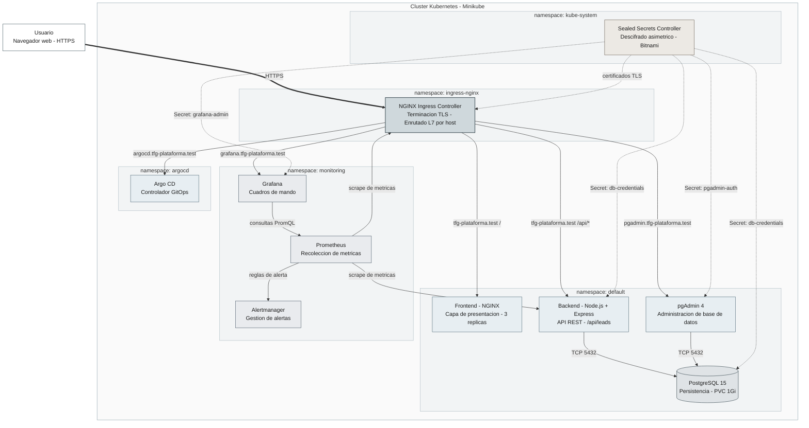

# Diagramas de Arquitectura

Diagramas de arquitectura del proyecto en formato Mermaid, listos para incorporar a la
memoria del Trabajo de Fin de Grado. Se dividen en dos vistas complementarias:

1. **Cadena de suministro (CI/CD + GitOps):** cómo un cambio en el código llega al clúster.
2. **Arquitectura runtime del clúster:** componentes desplegados, red, datos, observabilidad y seguridad.

Ambos reflejan exclusivamente las tecnologías presentes en el repositorio.

---

## 1. Cadena de suministro: CI/CD y flujo GitOps

```mermaid
%% =====================================================================
%% Diagrama 1 - Cadena de suministro: CI/CD y flujo GitOps
%% Orientacion LR: el flujo es una tuberia lineal de izquierda a derecha
%% =====================================================================
flowchart LR
    %% --- Actor externo ---
    DEV["Desarrollador"]:::external

    %% --- Control de versiones e Integracion Continua ---
    subgraph GITHUB["GitHub - Repositorio (Single Source of Truth)"]
        direction TB
        MAIN["Rama main<br/>Codigo fuente e infraestructura"]:::cicd
        ACTIONS["GitHub Actions<br/>Build multi-arch - QEMU + Docker Buildx"]:::cicd
        GITOPS["Rama gitops<br/>Manifiestos de apps fijados por SHA"]:::cicd
    end

    GHCR["GitHub Container Registry<br/>ghcr.io - imagenes Docker"]:::cicd

    %% --- Entrega Continua dentro del cluster ---
    subgraph CD["Entrega Continua - Cluster Kubernetes"]
        direction TB
        ARGOCD["Argo CD<br/>Controlador GitOps - patron App of Apps"]:::service
        WORKLOADS["Cargas de trabajo<br/>frontend - backend - base de datos - ingress - TLS"]:::service
    end

    %% --- Flujo de la tuberia ---
    DEV -->|"git push"| MAIN
    MAIN -->|"trigger - paths: src/backend, apps/frontend"| ACTIONS
    ACTIONS -->|"docker build and push"| GHCR
    ACTIONS -->|"actualiza tag SHA y hace commit"| GITOPS

    MAIN -.->|"reconcilia infraestructura (HEAD)"| ARGOCD
    GITOPS -.->|"reconcilia aplicaciones (SHA)"| ARGOCD
    ARGOCD -->|"sync - prune - self-heal"| WORKLOADS
    GHCR -->|"image pull"| WORKLOADS

    %% --- Estilos sobrios y uniformes ---
    classDef external fill:#ffffff,stroke:#455a64,stroke-width:1px,color:#1a1a1a
    classDef cicd fill:#eceff1,stroke:#455a64,stroke-width:1px,color:#1a1a1a
    classDef service fill:#e7eef2,stroke:#546e7a,stroke-width:1px,color:#1a1a1a

    style GITHUB fill:#f7f8f9,stroke:#b0bec5,stroke-width:1px
    style CD fill:#f7f8f9,stroke:#b0bec5,stroke-width:1px
```

**Lectura del diagrama.** El desarrollador solo interactúa con la rama `main`. A partir de
ahí el proceso es automático: GitHub Actions construye imágenes multiarquitectura
(`linux/amd64` y `linux/arm64`) y las publica en GHCR; además escribe el nuevo tag de imagen
(SHA del commit) en la rama `gitops`. Argo CD reconcilia la **infraestructura** desde `main`
(aplicación raíz, base de datos, ingresses, certificados TLS, monitorización) y las
**aplicaciones** (frontend y backend) desde `gitops`. Finalmente el clúster descarga las
imágenes desde GHCR.

---

## 2. Arquitectura runtime del clúster Kubernetes

**Lectura del diagrama.** Todo el tráfico externo entra por el **NGINX Ingress Controller**
(namespace `ingress-nginx`), que termina TLS y enruta a nivel 7 según el host. El namespace
`default` contiene la aplicación (frontend, backend, pgAdmin) y la persistencia (PostgreSQL
con PVC). El **Sealed Secrets Controller** (namespace `kube-system`) descifra los secretos
sellados y genera los `Secret` nativos consumidos por las cargas de trabajo y por el Ingress
(certificados TLS). La observabilidad reside en `monitoring` (Prometheus, Grafana,
Alertmanager) y Argo CD en su propio namespace `argocd`.

### Convención de colores

| Categoría | Uso |
|-----------|-----|
| Blanco / borde gris | Actores externos (usuario, desarrollador) |
| Gris claro | CI/CD y control de versiones |
| Gris azulado intenso | Red y balanceo (Ingress Controller) |
| Azul suave | Servicios y aplicaciones |
| Gris neutro | Bases de datos y almacenamiento |
| Gris frío | Observabilidad |
| Gris cálido | Seguridad (secretos sellados) |

---